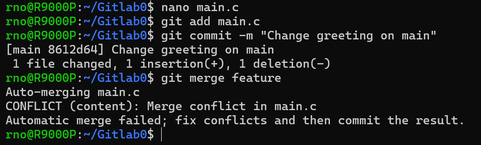
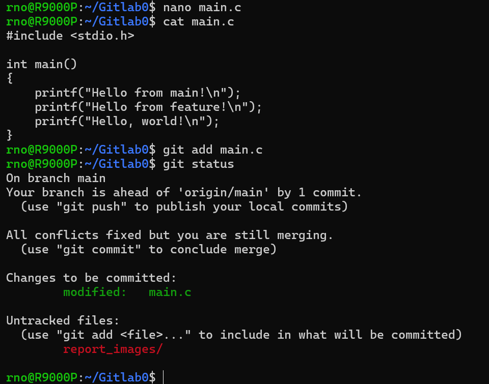

# Lab0：GitLab 实验报告

仓库：[ShadowRnO/Gitlab0](https://github.com/ShadowRnO/Gitlab0)

## 实验环境与过程

我在 Windows 上安装 WSL 2 和 Ubuntu，并在 Ubuntu 中使用 Git 2.53.0。通过课程模板仓库的 **Use this template → Create a new repository** 创建个人仓库，而非 Fork。随后在 Ubuntu 用户目录中运行 `git clone https://github.com/ShadowRnO/Gitlab0.git`。

1. 修改 `main.c`，加入 `printf("Hi, my name is RnO\n");`，并提交 `3ad6eaf`（`Complete main.c TODO`）。运行 `git push origin main` 后，GitHub 上出现这次提交。
2. 运行 `git switch -c feature`，把同一条输出语句改为 `Hello from feature!`，提交 `4819b38`。
3. 切回 `main`，把这条语句改为 `Hello from main!`，提交 `8612d64`。两个分支修改了同一位置。
4. 在 `main` 上运行 `git merge feature`，Git 报告 `main.c` 内容冲突。打开文件后可以看到 `<<<<<<< HEAD`、`=======` 和 `>>>>>>> feature` 标记。我保留两条输出语句，删除冲突标记，执行 `git add main.c`，再提交 `6373d3d`（`Merge feature into main and resolve conflict`）。
5. 把 `main` 和 `feature` 分支推送到 GitHub。`main` 的提交图中可以看到来自两个分支的提交汇合到合并提交。

合并时的终端提示：

解决后的文件内容与 Git 状态：

## 文档问题

### 以前是否有多人协同开发的经历？

此前没有多人一起写代码的经历，我写过的代码都是自己完成的。本次实验让我第一次实际操作分支合并和解决冲突。

### 为什么要把“暂存”和“提交”分成两步？

暂存允许我先选择要纳入下一次提交的改动，并在提交前检查。提交则把已经选好的改动保存为一个有说明、有历史位置的版本。这使一次提交可以只记录一件事，也能避免把尚未完成或无关的文件一起放进去。例如，解决合并冲突时我只暂存了 `main.c`，报告截图留待写报告时再提交。

### `git branch` 和 `git branch -a` 有什么区别？

`git branch` 默认列出本地分支；`git branch -a` 同时列出本地分支和本地保存的远程跟踪分支，如 `remotes/origin/main`。远程跟踪分支不是每次运行该命令时从 GitHub 实时获取的，必要时应先执行 `git fetch` 更新。[Git 官方手册](https://git-scm.com/docs/git-branch)

## 阅读与理解

### [Commit Message 和 Change log 编写指南](https://www.ruanyifeng.com/blog/2016/01/commit_message_change_log.html)

文章介绍了为什么提交说明应清楚表达本次改动，以及一种把说明分为标题、正文和脚注的格式。标题可以用 `type(scope): subject` 标明改动类型、范围和目的；正文与脚注在需要时补充背景或不兼容变更。统一格式便于查找历史记录、筛选不同类型的提交，也便于生成更新日志。本次实验的提交信息虽然没有使用完整格式，但我能通过 `git log` 清楚区分修改 TODO、两个分支的修改和合并提交。

### [Gitflow 使用规范](https://www.dafaycoding.com/article/git-gif-flow)

文章说明了 `master`、`develop`、`feature`、`release` 和 `hotfix` 等分支的职责：稳定版本放在主分支，开发工作先在开发分支整合，新功能、发布准备和紧急修复分别在相应的临时分支进行。这样可以把不同用途的改动隔开，再按流程合并。本次实验只使用 `main` 和 `feature`，并没有实践完整的 Gitflow，但通过实际发生的冲突，理解了不同分支修改同一位置时需要人工决定最终内容。

### 为什么要学习 Git？

这次实验中，Git 记录了每次修改的来源和顺序：我能查看 `main.c` 的改动，分别保存两个分支上的版本，再把它们合并。冲突出现时，Git 保留了双方内容供我选择；解决后，合并提交又记录了最终结果。把本地提交推送到 GitHub 后，仓库链接还能让别人查看代码和历史。因此，Git 不只是备份文件，也帮助我整理修改、追踪问题和与他人协作。

## 参考资料

- [Lab0 实验文档](https://ics-26fall-fdu.github.io/labs/lab0-git-lab/)
- [课程模板仓库与任务清单](https://github.com/ICS-26Fall-FDU/GitLab)
- [Git 分支命令文档](https://git-scm.com/docs/git-branch)
- [Commit Message 和 Change log 编写指南](https://www.ruanyifeng.com/blog/2016/01/commit_message_change_log.html)
- [Gitflow 使用规范](https://www.dafaycoding.com/article/git-gif-flow)
